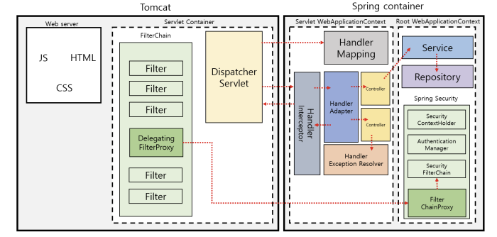
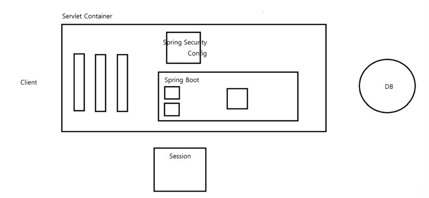

Spring security 👊🏻
=======================
- 웹 사이트를 이용할 때, 회원가입을 한 사용자에게만 접근을 허용하게 하거나, 관리자 페이지로의 접근은 관리자 권한을 가진 사용자만 허용하고 싶은 경우가 있다.
- 이때 사용하는 것이, **스프링 시큐리티 프레임 워크**
- 사용자의 **인증**과 **인가**를 통해 허가 받은 사용자만 접근을 허용할 수 있게 한다.  

#### 스프링의 기본적인 구조

- 사용자의 요청이 발생하면 서블릿 컨테이너의 여러 필터들을 통과한 후 Dispatcher Servlet에 의해 적절한  Controller로 배치
- 이후 부터는 우리가 알고 있는 흐름대로 Controller -> Service -> Repository 등의 계층을 거쳐 요청이 진행됨.

#### Spring Security 프레임워크 사용시
- FilterChain의 Delegating Filter Proxy에 의해 사용자의 요청을 가로챔
- 그리고 Security Filter Chain에 의해 사용자 인증과 인가를 거쳐 접근 권한이 있는 사용자에게 접근을 허용하게 됨
- 
- 클라이언트가 요청을 보내게 되면 Spring Security 프레임워크에 의해 Security Filter가 자동으로 생성
- 이 필터를 거쳐 사용자 인증, 인가 작업이 완료
- 그 후 스프링 프레임워크는 사용자 정보를 Session에 저장함 